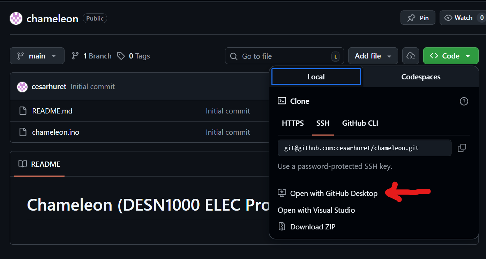

# Chameleon (DESN1000 ELEC Project)

## Index

1. [Getting Started](#1-getting-started)
2. [Architecture](#2-architecture)
3. [Contributing](#3-contributing)
4. [Testing](#4-testing)

## 1. Getting Started

1. Download the latest [Arduino IDE (click here to download)](https://www.arduino.cc/en/software/).
2. Download [GitHub Desktop](https://github.com/apps/desktop)
3. Clone this repository using GitHub Desktop: [https://github.com/cesarhuret/chameleon.git](https://github.com/cesarhuret/chameleon.git) (See image below)

4. When cloning the repository, change the path it is cloned to to the Arduino folder which can be found in `~/Documents/Arduino`
5. Open the Arduino IDE and click `File` and then `Open`. Select the folder you just cloned (in `Documents/Arduino/chameleon`)

## 2. Architecture

## 3. Contributing

## 4. Testing

Testing can be done with PlatformIO and more can be found in the [`Testing README`](/test/README).